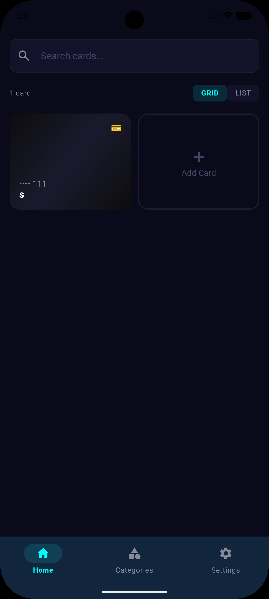
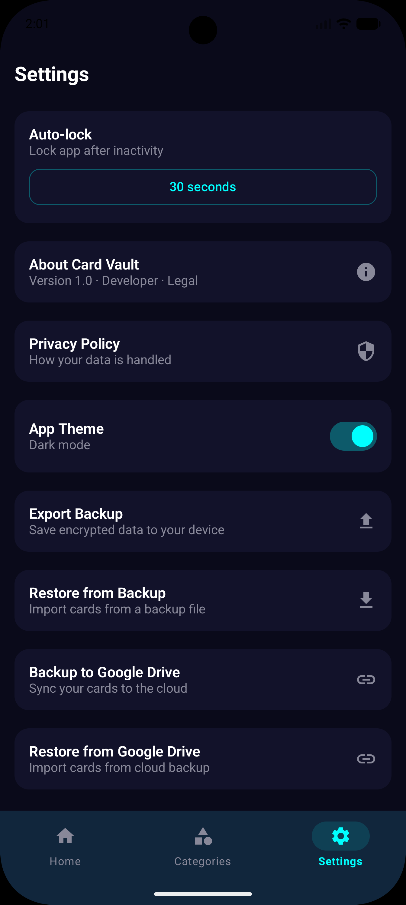
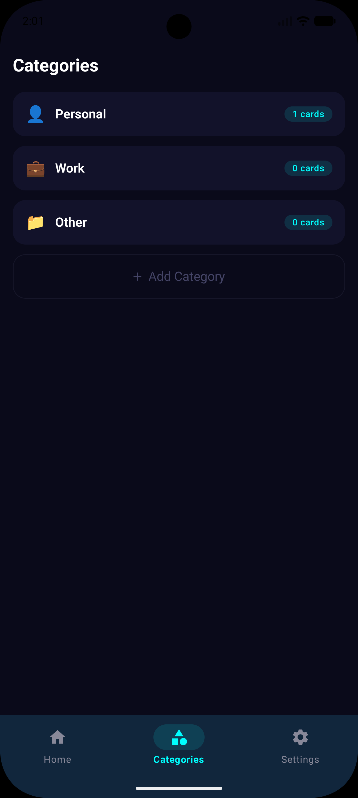

<p align="center">
  
</p>

<p align="center">
  
  
  
  
  
  
  
</p>

<p align="center">
  
  
  
</p>

<p align="center">
  <b>AES-256 encrypted</b> · <b>biometric lock</b> · <b>on-device OCR</b> · <b>offline-first</b>
</p>

---

Card Vault keeps your credit and debit cards safely encrypted on your phone. No accounts, no cloud, no tracking.

## Features

| | |
|---|---|
| 🔒 **AES-256 Encryption** | Every card photo encrypted with AES-256-GCM. Database secured with SQLCipher. Keys in Android Keystore. |
| 📸 **OCR Scanning** | Take a photo — card number, expiry, and issuer auto-fill via on-device ML Kit. No data leaves your phone. |
| 🧬 **Biometric Lock** | Fingerprint, face, or PIN unlock. Configurable auto-lock. Screenshots blocked on card details. |
| 💳 **Card Flip** | Tap to flip between front and back card photos with 3D animation. |
| 📂 **Categories** | Organize cards into custom groups. Search by name, issuer, or number. |
| ☁️ **Backup & Restore** | Encrypted local backups. Optional Google Drive sync. JSON export with AES encryption. |
| 📅 **Expiry Alerts** | Push notification 30 days before a card expires. |
| 🌙 **Dark & Light Themes** | Toggle between dark and light mode. All screens react instantly — no restart needed. |
| 🔐 **Privacy First** | No analytics, no tracking, no accounts, no internet required. |

## Screenshots

<p align="center">
  
  
  
  
</p>

<p align="center">
  
  
  
  
</p>

## Tech Stack

| Layer | Technology |
|---|---|
| **Language** | Kotlin 1.9 |
| **UI** | Jetpack Compose + Material 3 |
| **Database** | Room + SQLCipher (AES-256 encrypted) |
| **Encryption** | Android Security Crypto (EncryptedFile, EncryptedSharedPreferences) |
| **Auth** | Android Biometric API (fingerprint, face, PIN) |
| **OCR** | Google ML Kit Text Recognition (on-device) |
| **Image Loading** | Coil |
| **Backup** | Google Drive API (optional) |
| **Analytics** | None |
| **minSdk / targetSdk** | 28 / 34 |

## Security

- All data encrypted at rest (AES-256-GCM for images, SQLCipher for database)
- Encryption keys stored in Android Keystore (hardware-backed on supported devices)
- `FLAG_SECURE` prevents screenshots on card details
- Biometric authentication on launch with configurable timeout
- Notifications hidden on lock screen (`VISIBILITY_PRIVATE`)
- Log output redacts potential credit card numbers
- Root detection at startup
- Network security config blocks cleartext HTTP
- Automatic backup disabled

## Building

```bash
# Debug APK
./gradlew assembleDebug

# Release APK (signed with your own keystore)
./gradlew assembleRelease
```

## License

MIT

---

<p align="center">
  <sub>Built with ❤️ by <a href="https://github.com/sunnybhatnagar">Sunny Bhatnagar</a></sub>
</p>
